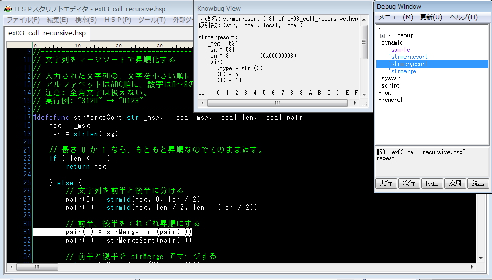

## 機能詳細
本家版とはインターフェースが異なり、2つのウィンドウがあります。ツリービューは変数のリストの代替であり、そこで選択されるノードに関する情報が、もう一つの灰色メッセージウィンドウに表示されます。

#### ツリービュー
ツリービューには、すべての静的変数をモジュールごとに分類して並べています。この項目を選択すると、下のボックスに変数の内容 (変数情報) が表示されます。

#### 静的変数
* 変数名:
  * 変数の名前です。
  * モジュールの中にある変数も、完全な名前 (@ を含む) で表示します。
* 変数型:
   * 変数の型を次の形式で表します。
     * ``<vt><tq> <index>``
   * `<vt>` は変数の型の名前です。
   * `<tq>` は変数のモードを表します。通常は空("")です。
     * 変数がクローン変数のとき「&」と表示されます。
     * 変数が無効な状態のとき、「!」と表示されます。
   *  `<index>` は配列の形を表します。
     * 1次元配列の場合、「(x)」です。(x はその要素数)
     * 2次元配列の場合、「(x, y) (N in total)」と表示されます。
       * x, y はそれぞれ1,2次元目の要素数で、N は配列全体の要素数です。
     * 3,4次元配列の場合は、2次元配列と同様です。
   * 表示例: 「int (2, 3) (6 in total)」
* アドレス:
  * 2つの8桁の16進数で表します。
    0. 変数の実体データがあるメモリのアドレス (PVal::pt)
    0. 変数のマスターデータがあるメモリのアドレス (PVal::master)
  * 設定ファイルで非表示にできます。
* サイズ:
  * ``X / Y [byte]`` の形式で表します。
  * X は実体データのサイズを、Y はバッファのサイズを表します。(どちらもバイト単位)
  * 設定ファイルで非表示にできます。

変数がもつデータは、ツリー形式の文字列で表されます。基本的に本家と同じですが、配列やインスタンス(モジュール型変数の値)は、以下のように表示します:
```
  (単体: 一次元一要素)
  要素名 = 値

  (一次元配列)
  要素名:
    .type = 型名[&] (要素数)
    要素リスト

  (多次元配列)
  要素名:
    .type = 型名[&] (要素数(1), ...) (全要素数 in total)
    要素リスト

  (インスタンス)
  要素名:
    .modcls = モジュール名[&]
    要素リスト
```
* 記号「&」は参照(何かを指し示すもの)を表していると思ってください。
  * 配列変数の型名についている「&」は、その変数がクローン変数であることを示します。クローン変数とは、dup, dupper 命令で作成されるものです。
  * インスタンスのモジュール名の後についている「&」は、そのインスタンスが他のインスタンスへの弱参照であることを示します。弱参照とは、モジュール変数の値を他の変数に「代入」したときに作成されるあれです。

#### モジュール
モジュール名のノード(「@...」)自体を選択すると、そのモジュールが持つすべての
静的変数の値を、簡単に表示します。
```
  (モジュール)
  [@モジュール名]
  変数名 = 値
  ...
```


#### システム変数
ルートに位置する「+sysvar」ノードの直下には、システム変数の項があります。

* cnt:
  * cnt は配列のように表示されます。第一項に相当するものが一番外側のループの cnt で、最後の値、 looplev 番目が現在の cnt の値になります。
  * repeat ループが実行中でないときは、「(out_of_loop)」と表示されます。
  * メモリダンプ範囲は HSPCTX::mem_loop[1～looplev] となっています。
```
(例)
  cnt:
    #(looplev) = (現在のcntの値)
    #(looplev-1) = 0
    ...
    #1 = 0
  なお n = looplev となります。
```

* notebuf:
  * 「notebuf」はシステム変数ではありませんが、最後に notesel 命令で指定された (まだ notensel されていない) バッファを表示します。

「+sysvar」ノード自体を選択すると、システム変数の一覧が表示されます。

#### 呼び出し
WrapCall 対応版を使用している場合、「+dynamic」ノードが存在します。この直下には、呼び出されているユーザ定義コマンドを表すノードが実行に合わせて追加されます。



呼び出しを表すノードを選択すると、以下の形式で、その実引数を表示します:
```
  関数名: 命令または関数の名前
  仮引数: (仮引数タイプ, ...)

  関数名:
    (0) = 第一引数の値
    (1) = 第ニ引数の値
    ...
```
「(N)」は、N番目の仮引数を表します。HSPのバージョンが新しければ、代わりに仮引数(エイリアス)の名前が表示されます。\#modfunc, \#modcfunc の最初の引数の名前は「thismod」と表示されます。

呼び出しノードは、命令や関数がみつかった時点でツリービューに追加されます。以下の例でいうと、mystmt、myfunc がこの順番でノードに追加されます。
```hsp
#module
#deffunc mystmt var, int
#defcfunc myfunc int
#global

  mystmt x, myfunc(0)
```
myfunc を実行している間、mystmt の実引数の値は未確定なので、次のように表示されます。
```
  mystmt:
    arguments : (not_available)
```
WrapCall では `#modinit`、`#modterm`、または ``\#deffunc onexit`` で定義された関数の呼び出しを検出することができません。これらの実行中かもしれないときは、他の呼び出しの実引数情報を正しく取得できないことがあります。その場合は次のように、値を読み取るのが危険な実引数の値が省略されます。
```
  mystmt:
    x : (unsafe)        //変数の読み取りは危険
    i = 1               //整数値の読み取りは安全
```

#### 「ログ」ノード
logmes 命令で送られてきたログを表示します。

* 「更新」: ログを最新の状態に更新します。
* 「保存」: ログをファイルに保存します。
  * (ファイルを指定するダイアログが開きます。)
  * なお、設定ファイル(knowbug.ini)を用いて、終了時にログを自動で保存するようにできます。
* 「消去」:
  * ログをすべて消去します。

* 「自動スクロール」メニュー:
  * これが付いている間、ログの最後尾まで自動でスクロールします。
* 「呼び出しを記録」メニュー:
  * これが付いている間、ユーザ定義コマンドの呼び出しが開始・終了するたびに、そのことがログに出力されます。
  * WrapCall と接続している場合にのみ有効です。

#### 「スクリプト」ノード
実行中のスクリプトファイルがみつかった場合は、その内容を表示し、実行している行を自動で選択します。

#### 「全般」ノード
内容は本家とだいたい同じです (ランタイムから供給されるもの)。
win32gui版では、カレント・ポジション (pos) とカレント色 (color) も表示します。

### 実行制御
通常の「実行」「次行」「停止」ボタンの横に、加えて「次飛」「脱出」ボタンが
追加されています。

* 「実行」(Run):
  * assert 命令などで停止していた実行を再開します。
* 「次行」(Step In):
  * 次の命令を1つ実行して、再び停止します。
* 「停止」(Stop):
  * 実行を停止します。
* 「次飛」(Step Over):
  * 「次行」と同様に次の命令を実行しますが、それがユーザ定義命令・関数である場合は、その内部の実行が終了してから停止します。
  * これを押した後、マウスを動かすなどして、デバッグウィンドウにメッセージを送らないと実行位置の表示が更新されません。(既知の不具合)
```
(例)
  // ユーザ定義命令 test1, test2 があるとして
  assert
  test1 // ←今ここ！ (assert で停止した)
  test2

ここで「次飛」を使うと、

  test1 // test1 の実行が完了する
  test2 // ←今ここ！ (test2 の実行直前で停止する)

となる。
```
* 「脱出」(Step Out):
  * 次の return まで実行します。
  * ユーザ定義命令・関数の定義の中で使用すると、その命令が終了するところまで実行します。
```
(例)
  test1
  mes "hello"
  stop

  #deffunc test1
    assert
    mes "process" // ←今ここ！ (assert で停止した)
    a = 1
    test2
    return

ここで「脱出」を使うと、

  test1     // test1 の実行が完了する
  mes "hello"   // ←今ここ！

となる。
```
